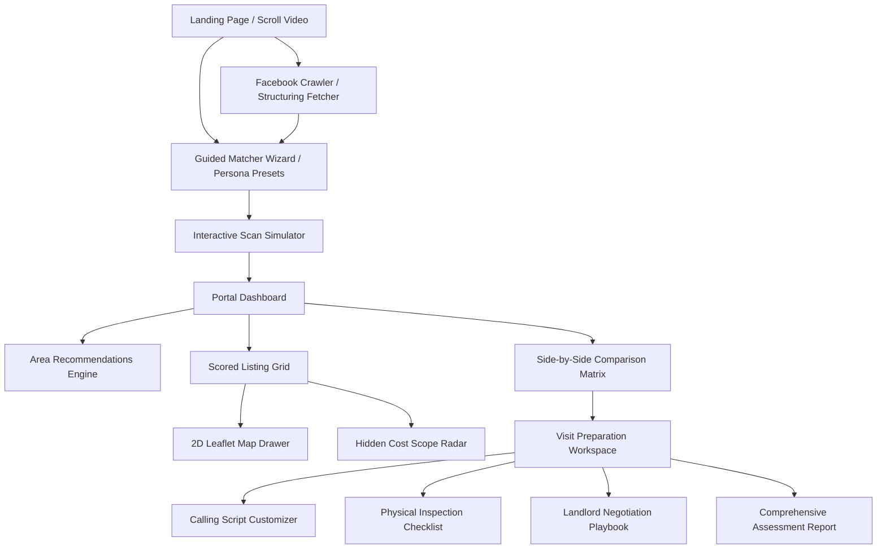

# 🏠 BasaBondhu (বাসাবন্ধু)

> **From messy listings to 3 homes worth visiting.**  
> An immersive, renter intelligence platform purpose-built for house-hunters navigating the opaque Dhaka housing market.

[](https://nextjs.org/)
[](https://react.dev/)
[](https://tailwindcss.com/)
[](https://www.typescriptlang.org/)
[](https://www.framer.com/motion/)
[](https://leafletjs.com/)

---

## 🗺️ Project Overview

**BasaBondhu** (literally *"House Friend"* in Bangla) bridges the gap between raw, messy social media listings and structured, actionable decision-making. 

Instead of browsing endless social media posts or dealing with unreliable brokers, BasaBondhu guides you through a structured search flow, calculates real upfront costs, factors in commute anchors, surfaces hidden cost parameters, lets you visually map results, and builds print-ready visit preparation scripts and inspection checklists.



---

## 🚀 Key Features

### 1. Immersive Scroll Landing Experience
* **Cinematic Scrolling**: Features high-contrast typography, premium gold/dark-mode gradients, and a scroll-driven background canvas animation simulating high-end visual design.
* **Smart Entries**: Provides quick-action navigation buttons to launch either the Matcher Wizard or the Crawler directly.
* **File Reference**: [LandingPage.tsx](file:///home/aspen/ProjectCollections/bashaBondhu/Bashabondhu/basabondhu/components/LandingPage.tsx) | [ScrollVideo.tsx](file:///home/aspen/ProjectCollections/bashaBondhu/Bashabondhu/basabondhu/components/ScrollVideo.tsx)

### 2. Guided Matcher Wizard & Personas
* **Guided Step Process**: An animated 4-step configuration collecting:
  1. **Household Details**: Bachelor/couple filters, female-only flat markers, or multi-member families.
  2. **Financial Boundaries**: Maximum monthly rent and available shifting/advance cash.
  3. **Commute Anchors**: Office, university, or neighborhood locations.
  4. **Deal Breakers**: Filters for waterlogging, lift requirements, generator backups, and gas type preferences.
* **Dhaka Persona Presets**: Quickstart buttons representing typical Dhaka residents (e.g., *Nusrat the Student*, *Abrar the Bachelor*, *Rafi & Mita the Corporate Couple*) to instantly populate presets.
* **File Reference**: [Wizard.tsx](file:///home/aspen/ProjectCollections/bashaBondhu/Bashabondhu/basabondhu/components/Wizard.tsx) | [personas.ts](file:///home/aspen/ProjectCollections/bashaBondhu/Bashabondhu/basabondhu/lib/data/personas.ts)

### 3. Facebook Crawler & Text Structuring Fetcher
* **Headless Parser**: Bypasses Facebook routing using a custom scraper agent simulating Googlebot requests to fetch raw post texts.
* **Auto-Fill Extraction**: A Regex-based parsing engine parses listing text (rent, size, bedrooms, service charge, lift, advance requirements, gas pipeline presence).
* **Scan Simulator Sync**: A **"Start Scanning Similar homes now"** button feeds extracted listing parameters directly into the scan simulator.
* **File Reference**: [FacebookFetcher.tsx](file:///home/aspen/ProjectCollections/bashaBondhu/Bashabondhu/basabondhu/components/FacebookFetcher.tsx) | [route.ts](file:///home/aspen/ProjectCollections/bashaBondhu/Bashabondhu/basabondhu/app/api/facebook/fetch/route.ts)

### 4. Raw Listing Checker & Red Flags Engine
* **Ad-hoc Checker**: Analyze pasted listing descriptions instantly.
* **Red Flags Warning Engine**: Highlights critical warnings (e.g., "unspecified service charge", "no gas pipeline", "bachelor restrictions apply", "excessive advance payment requested").
* **Suitability Verdict Badge**: Renders an intuitive recommendation status: `Visit`, `Maybe`, `Call First`, or `Avoid`.
* **File Reference**: [ListingChecker.tsx](file:///home/aspen/ProjectCollections/bashaBondhu/Bashabondhu/basabondhu/components/ListingChecker.tsx) | [parser.ts](file:///home/aspen/ProjectCollections/bashaBondhu/Bashabondhu/basabondhu/lib/parser.ts)

### 5. Multi-Factor Scoring Engine
The core scoring utility matches properties using weighted indexes (e.g., rent vs. budget, location commute, dealbreaker match rates, and hidden cost metrics).
* **Budget Fit (25%)**: Exponential score reduction if rent exceeds user limits.
* **First Month Fit (10%)**: Checks if advance, deposit, brokerage, and shifting costs fit within cash reserves.
* **Commute Fit (20%)**: Calculates commute proximity scores using geographical matrixes.
* **Household Type Match (15%)**: Strictly filters out bachelor/student restrictions.
* **Hidden Cost Penalty (15%)**: Lowers scores of listings with ambiguous utilities.
* **Other metrics**: Utility Clarity (5%), Waterlogging Risk (5%), and Listing Trust (5%).
* **File Reference**: [scoring.ts](file:///home/aspen/ProjectCollections/bashaBondhu/Bashabondhu/basabondhu/lib/scoring.ts) | [cost-calculator.ts](file:///home/aspen/ProjectCollections/bashaBondhu/Bashabondhu/basabondhu/lib/cost-calculator.ts)

### 6. Interactive Scan Simulator & Map Drawer
* **Radar Scan Animation**: Features a high-fidelity visual processing canvas ("Analyzing commute loads", "Mapping waterlogging coordinates").
* **Leaflet 2D Badges**: Displays shortlisted properties on an interactive Leaflet map using custom badge markers containing rents and details to prevent overlap.
* **File Reference**: [DemoScanAnimation.tsx](file:///home/aspen/ProjectCollections/bashaBondhu/Bashabondhu/basabondhu/components/DemoScanAnimation.tsx) | [DrawerMapInner.tsx](file:///home/aspen/ProjectCollections/bashaBondhu/Bashabondhu/basabondhu/components/DrawerMapInner.tsx)

### 7. Hidden Costs Scope Radar
* **Risk Ambiguity Progress Gauge**: Shows overall risk percentage.
* **Severity Sliders**: Presents interactive sliders for risk indicators (Iron levels, electricity load, pipeline vs. LPG cylinder gas, stairway width).
* **Status Pulses**: Animated color-coded rings (emerald, amber, rose) pulsing to highlight severe omissions.
* **File Reference**: [HiddenCostScopeRadar.tsx](file:///home/aspen/ProjectCollections/bashaBondhu/Bashabondhu/basabondhu/components/HiddenCostScopeRadar.tsx)

### 8. Side-by-Side Comparison Matrix
* **Spec Matrix**: Composes a comparison table of shortlisted properties.
* **Highlighting**: Highlights ideal options (e.g., *"Cheapest Rent"*, *"Lowest Cash"*).
* **Visit Sequencing**: Ranks properties (`#1 Visit First`, `#2 Visit 2nd`, etc.). Clicking `#1 Visit First` takes the user to the Visit Prep Workspace.
* **File Reference**: [ListingComparison.tsx](file:///home/aspen/ProjectCollections/bashaBondhu/Bashabondhu/basabondhu/components/ListingComparison.tsx)

### 9. Visit Preparation Workspace
* **Calling Script Customizer**: Pre-fills Banglish dialogues based on fetched properties. Features a markdown editor action bar providing **Bold**, *Italic*, Underline, and Template Reset actions. Toggle between "Save" and "Edit" modes.
* **Physical Inspection Checklist**: Divided into "Utilities & Hardware" and "Neighborhood & Building Environment". Uses square checkboxes and native HTML5 Drag-and-Drop handles to reorder items dynamically. Supports custom check note insertions.
* **Playbooks**: Comprehensive landlord guidelines, curfew rules, receipt issues, flat orientation considerations, and notices.
* **File Reference**: [VisitPlanner.tsx](file:///home/aspen/ProjectCollections/bashaBondhu/Bashabondhu/basabondhu/components/VisitPlanner.tsx)

### 10. Printable Comprehensive Assessment Report
* **Summary Overview**: Compiles budget details, transit anchors, and final rankings.
* **Shortlisted Plan**: Formats the selected properties list.
* **Print Preview**: A print-friendly style template compiling checklists, custom phone scripts, and warnings.
* **File Reference**: [ReportPreview.tsx](file:///home/aspen/ProjectCollections/bashaBondhu/Bashabondhu/basabondhu/components/ReportPreview.tsx)

---

## 🛠️ Technology Stack & Libraries

| Dependency | Version | Purpose |
| :--- | :--- | :--- |
| **Next.js** | `16.2.9` | App Router compilation, Server Actions, API optimization, and routing |
| **React** | `19.2.4` | Virtual DOM rendering, state providers, and hooks configuration |
| **Tailwind CSS** | `^4.0` | Sleek CSS utility styling, smooth color palettes, dark modes |
| **Framer Motion**| `^12.4` | Premium micro-animations, stepper slides, and radar pulse effects |
| **Leaflet** | `^1.9.4` | Maps engine rendering geographical location sectors |
| **React Leaflet** | `^5.0.0` | React wrapper elements integration for Leaflet tiles |
| **Lucide React** | `^1.21` | Premium vector icons, dashboard badges, status indicators |
| **TypeScript** | `^5.0` | Strict static checking, typing declarations, type safety |
| **PostCSS** | `^4.0` | Custom styling transforms and tailwind compiling presets |

---

## ⚙️ Configuration & Environment

Configuration is loaded through environment files. Create a `.env.local` inside the `basabondhu/` directory:

```bash
# Path: basabondhu/.env.local
OPENROUTER_API_KEY=your_openrouter_api_key_here
NEXT_PUBLIC_APP_URL=http://localhost:3000
```

---

## 🚦 Running the Project

### Prerequisites
* **Node.js** (v18.0.0 or higher)
* **npm** (v9.0.0 or higher)

### Setup & Run Commands

You can run the application directly from the root directory using the root-level scripts, or by entering the `basabondhu` directory.

#### 1. Running from Root Directory

To run using root-level shortcut commands:

```bash
# Install root-level tooling and configurations
npm install

# Start Next.js development server
npm run dev

# Build the project for production
npm run build

# Start the production build server
npm run start

# Lint files using ESLint
npm run lint
```

#### 2. Running from basabondhu Directory

```bash
# Navigate into basabondhu
cd basabondhu

# Install package dependencies
npm install

# Start Next.js development server
npm run dev

# Run project cleanups (deletes next caches)
npm run clean

# Delete root lock file if required
npm run clean-root-lock
```

---

## 📂 Project Directory Structure

```text
Bashabondhu/
├── PRD.md                       # Product Requirements Document
├── feature_map.md               # Quick mapping directory of all modules
├── documentation.tex            # In-depth LaTeX source documentation
├── package.json                 # Root script definitions
└── basabondhu/                  # Next.js web application root
    ├── app/                     # Page components & API routes
    │   ├── api/                 # Backend API gateways
    │   │   ├── facebook/        # Crawler and auto-filler scripts
    │   │   └── listings/        # Mock & matched property retrieval
    │   ├── portal/              # Portal Dashboard routing
    │   ├── globals.css          # Main stylesheet and Tailwind imports
    │   └── layout.tsx           # Base page layout structure
    ├── components/              # Interactive UI components library
    │   ├── LandingPage.tsx      # Entry Cinematic landing page
    │   ├── Wizard.tsx           # Stepper questionnaire onboarding
    │   ├── DrawerMapInner.tsx   # Leaflet maps and marker badging logic
    │   ├── HiddenCostScopeRadar.tsx # Progress dials and severity risks
    │   ├── VisitPlanner.tsx     # Checklists, calling scripts editor
    │   └── FacebookFetcher.tsx  # Crawler parser card integrations
    ├── context/                 # Context providers
    │   └── SearchContext.tsx    # State management system
    ├── lib/                     # Utilities and helpers
    │   ├── scoring.ts           # Multi-factor score matching computations
    │   ├── parser.ts            # Regex text-scraping algorithms
    │   └── data/                # Areas, persona presets, and sample listings
    ├── public/                  # Public assets, images, and maps
    │   ├── DhakaImages/         # Local neighborhood visual datasets
    │   └── Logos/               # Custom UI logo designs
    ├── tsconfig.json            # Static compiler config
    └── package.json             # App dependencies list
```

---

> [!TIP]
> **Pro Tip**: Use the **Persona Presets** in the Wizard (e.g. *Nusrat* or *Abrar*) to instantly skip forms and view the Portal Dashboard with pre-configured housing criteria.

> [!WARNING]
> **Warning**: Ensure Node.js version matches `v18+` to avoid compilation errors due to newer ES features used in Next.js Server Components.
