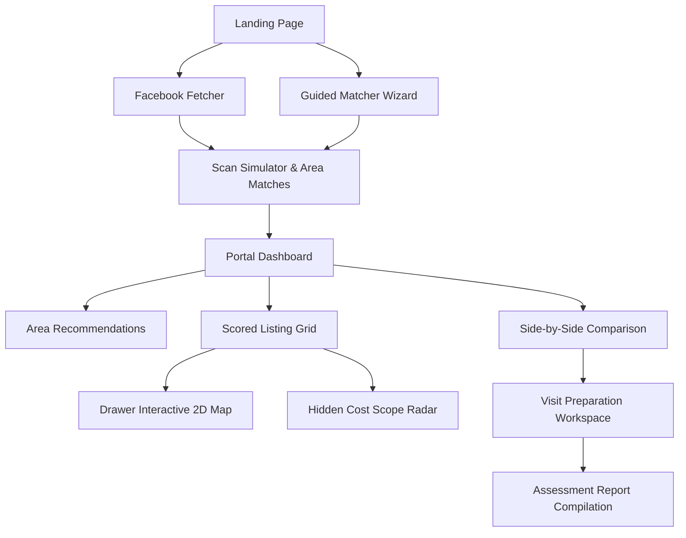

# BasaBondhu Feature Map

Welcome to the BasaBondhu feature map. This document lists and maps all the active user-facing features, modules, sub-components, and underlying business logic implemented in the BasaBondhu application.

---

## 🗺️ High-Level Architecture Overview

BasaBondhu is structured as an interactive renter intelligence platform for Dhaka city. It bridges the gap between raw, messy social media listings and structured, actionable decision-making tools.

---

## 🛠️ Main Feature Modules

### 1. Hero Entrance & Immersive Scroll Experience
* **Landing Page Cinematic**: Fully custom landing screen designed with high-contrast typography, premium gold gradients, and a frame-by-frame scroll-driven background video simulation.
* **Navigation Center**: Seamless transition buttons to either launch the Matcher Wizard or crawl raw listings directly.
* **Code Reference**:
  * [LandingPage.tsx](file:///home/aspen/ProjectCollections/bashaBondhu/Bashabondhu/basabondhu/components/LandingPage.tsx) — Main layout container
  * [ScrollVideo.tsx](file:///home/aspen/ProjectCollections/bashaBondhu/Bashabondhu/basabondhu/components/ScrollVideo.tsx) — Immersive canvas-driven rendering

---

### 2. Onboarding & Guided Matcher Wizard
* **Guided Form Stepper**: A 3-step animated configuration wizard collecting:
  1. **Household Details**: Bachelor status, couple status, female-only flat filters, or multi-member families.
  2. **Financial Boundaries**: Monthly budget limit and maximum available upfront (first-month shifting) cash.
  3. **Commute Anchors**: Office or university location markers (commute transit hubs).
  4. **Deal Breakers & Priorities**: Checklist criteria such as natural light, generator backups, lift access, or low waterlogging histories.
* **Persona Quick Selectors**: Quickstart selectors allowing users to instantly load realistic presets representing common Dhaka profiles (e.g. *Nusrat* the student, *Abrar* the bachelor, *Rafi & Mita* the corporate couple, etc.).
* **Code Reference**:
  * [Wizard.tsx](file:///home/aspen/ProjectCollections/bashaBondhu/Bashabondhu/basabondhu/components/Wizard.tsx) — Guided matcher stepper form
  * [personas.ts](file:///home/aspen/ProjectCollections/bashaBondhu/Bashabondhu/basabondhu/lib/data/personas.ts) — Dhaka renter preset databases

---

### 3. Facebook Crawler & Structuring Fetcher
* **Headless Link Parser**: Backed by a server-side route crawling interface mapping test links and bypassing Facebook descriptions to return absolute, un-truncated post captions.
* **Auto-Fill Extraction**: A Regex-based parsing engine extracting housing parameters from unstructured descriptions (rent, bedrooms, lift, advance requirements, gas type).
* **Instant Auto-Scanner**: A call-to-action button ("Start Scanning Similar homes now") that formats parsed outputs directly into a search profile, starts the scan simulator, and redirects to matching results.
* **Code Reference**:
  * [FacebookFetcher.tsx](file:///home/aspen/ProjectCollections/bashaBondhu/Bashabondhu/basabondhu/components/FacebookFetcher.tsx) — Crawler interface and button triggers
  * [/api/facebook/fetch/route.ts](file:///home/aspen/ProjectCollections/bashaBondhu/Bashabondhu/basabondhu/app/api/facebook/fetch/route.ts) — Backend crawler agent simulating Googlebot requests

---

### 4. Raw Listing Checker
* **Unstructured Text Parsing Tool**: An alternate workflow allowing users to paste *any* custom Facebook listing text directly to analyze its parameters.
* **Red Flags & Warning Engine**: Instantly lists warning bullet points (e.g., "bachelor restrictions apply", "unspecified service charge", "no gas pipeline").
* **Suitability Verdict Badge**: Color-coded output indicating if a listing is a "Visit", "Maybe", "Call First", or "Avoid".
* **Code Reference**:
  * [ListingChecker.tsx](file:///home/aspen/ProjectCollections/bashaBondhu/Bashabondhu/basabondhu/components/ListingChecker.tsx) — Pasted checklist card
  * [parser.ts](file:///home/aspen/ProjectCollections/bashaBondhu/Bashabondhu/basabondhu/lib/parser.ts) — Text-parsing utility

---

### 5. Area Recommendations Engine
* **Commute Hub Matcher**: Score-maps user office or school commute anchors to recommend suitable adjacent residential sectors.
* **Tradeoff Indicators**: Lists explicit rent guidelines, suitability matching, transport modes, and major tradeoffs (e.g. "Banasree has cheaper rent but commute to Banani office is congested in peak hours").
* **Code Reference**:
  * [AreaRecommendations.tsx](file:///home/aspen/ProjectCollections/bashaBondhu/Bashabondhu/basabondhu/components/AreaRecommendations.tsx) — Recommendation cards section

---

### 6. Interactive 2D Map Scanner
* **Radar Scan Simulation**: Playful scan radar showing processing stats ("Analyzing commute loads", "Mapping waterlogging coordinates") when search begins.
* **Leaflet Integrated Badges**: Displays shortlisted homes using modern 2D badge cards containing details (rent, size) and name labels directly embedded to prevent map overlapping.
* **Code Reference**:
  * [DemoScanAnimation.tsx](file:///home/aspen/ProjectCollections/bashaBondhu/Bashabondhu/basabondhu/components/DemoScanAnimation.tsx) — Scan radar animation
  * [DrawerMapInner.tsx](file:///home/aspen/ProjectCollections/bashaBondhu/Bashabondhu/basabondhu/components/DrawerMapInner.tsx) — Map marker configurations

---

### 7. Hidden Costs Scope Radar
* **Risk Ambiguity Index**: Top-level progress gauge presenting overall ambiguity percentage.
* **Continuous severity sliders**: Visual progress bar indicators showing threat score levels.
* **Threat Status Pulses**: Animated color-coded rings (sky, emerald, rose, amber) pulsing to indicate hazard level.
* **Key Category Details**:
  * *Water Quality & Pressure* (iron levels, pump bill splits)
  * *Electricity & Prepaid Meters* (load capacity limits, meter debts)
  * *Gas Connection Availability* (pipeline gas vs LPG cylinder refills)
  * *Safety & Fire Escapes* (stairway width, guard night routines)
* **Code Reference**:
  * [HiddenCostScopeRadar.tsx](file:///home/aspen/ProjectCollections/bashaBondhu/Bashabondhu/basabondhu/components/HiddenCostScopeRadar.tsx) — Scopes visualization dashboard

---

### 8. Side-by-Side Comparison Matrix
* **Spec comparison table**: Generates side-by-side spec sheets for selected matching listings comparing monthly rents, total upfront shifting cash, bedrooms/baths, gas supplies, generator backups, lift availability, and waterlogging risks.
* **Cheapest & Lowest Cash Badges**: Highlights ideal cost options.
* **Visit Order Sequence Sorting**: Arranges selected properties from best to worst based on fit score calculations (`#1 Visit First`, `#2 Visit 2nd`, `#3 Visit 3rd`).
* **Wired Navigation**: The "#1 Visit First" element functions as a redirection button to the Visit Prep Workspace.
* **Code Reference**:
  * [ListingComparison.tsx](file:///home/aspen/ProjectCollections/bashaBondhu/Bashabondhu/basabondhu/components/ListingComparison.tsx) — Side-by-side comparison table

---

### 9. Visit Preparation Workspace
* **Calling Script Customizer**:
  * Pre-loaded Banglish dialogues compiled based on matched parameters (service charge, cylinder gas, advance months).
  * Save/Edit toggle mode switching.
  * Formatting Action Bar providing selection styling: **Bold**, *Italics*, Underline, and Template Reset.
* **Physical Inspection Blueprint**:
  * Interactive checklists categorized into "Utilities & Hardware" and "Neighborhood & Building Environment".
  * Square checklist notes for checkable tasks.
  * Native HTML5 drag-and-drop handles for reordering items, complete with highlight overlays during drags.
  * Custom check note forms to add new checkpoints on the fly.
* **Landlord Negotiation Playbook**: Information cards detailing guidelines on curfews/gates, security deposits, service charges, maintenance duties, and monthly official receipts.
* **Listing Creation Factors**: Guidelines specifying flat orientations (valuing south/east wind flows), gas type importance, notices, and tenant matching constraints.
* **Code Reference**:
  * [VisitPlanner.tsx](file:///home/aspen/ProjectCollections/bashaBondhu/Bashabondhu/basabondhu/components/VisitPlanner.tsx) — Multi-tab preparation workspace component

---

### 10. Comprehensive Assessment Report
* **Plan Summary Overview**: Detailed renter criteria summary compiling transit hubs, budget, and matched numbers.
* **Shortlisted Plan & Visit Order**: Summary maps detailing the recommended order of property inspections.
* **Printable Output compiles**: Ready-to-use print template formats aggregating checklists, warning parameters, and phone script transcripts.
* **Code Reference**:
  * [ReportPreview.tsx](file:///home/aspen/ProjectCollections/bashaBondhu/Bashabondhu/basabondhu/components/ReportPreview.tsx) — Assessment report preview panel
