# BasaBondhu — Functional Feature Map

BasaBondhu is a guided house-hunting helper tailored for urban renters and buyers in Bangladesh. Its product promise is **"From messy listings to 3 homes worth visiting."**

This document maps out all features of the application, showing how sub-features nest under their respective parent/umbrella domains, accompanied by their corresponding source code references.

---

## 1. High-Level Feature Architecture

The following diagram maps out how BasaBondhu’s features are structured across **5 User-Facing Modes** and **1 Core Intelligence Foundation**:

```mermaid
graph TD
    %% Base styling
    classDef domain fill:#fdf6e2,stroke:#d4af37,stroke-width:2px,color:#2c3e50;
    classDef feature fill:#eef6f9,stroke:#5ea5c8,stroke-width:1.5px,color:#2c3e50;
    classDef detail fill:#ffffff,stroke:#cbd5e1,stroke-width:1px,color:#475569;

    Root["BasaBondhu MVP Feature Map"]:::domain

    Root --> Mode1["1. Plan Search (Guided Discovery)"]:::domain
    Root --> Mode2["2. Check Listing (Pasted Text Scan)"]:::domain
    Root --> Mode3["3. Compare Homes (Side-by-Side)"]:::domain
    Root --> Mode4["4. Prepare Visit (Pre-Visit Kit)"]:::domain
    Root --> Mode5["5. Housing Report (Consolidated PDF)"]:::domain
    Root --> Mode6["6. Engine & Tech Foundations"]:::domain

    %% Mode 1
    Mode1 --> M1_Wizard["Guided 4-Step Wizard Form"]:::feature
    M1_Wizard --> M1_W1["Rent/Buy & Sublet Selections"]:::detail
    M1_Wizard --> M1_W2["Household & Financial Guardrails"]:::detail
    M1_Wizard --> M1_W3["Commute Anchor Addresses"]:::detail
    M1_Wizard --> M1_W4["Priorities & Deal-Breaker Grid"]:::detail

    Mode1 --> M1_AreaRec["Area Recommendations Engine"]:::feature
    M1_AreaRec --> M1_AR1["Top 3 Matching Dhaka Neighborhoods"]:::detail
    M1_AreaRec --> M1_AR2["Plain-Language Trade-Off Summary"]:::detail
    M1_AreaRec --> M1_AR3["Key Risk Metrics (Waterlogging, Gas, etc.)"]:::detail

    Mode1 --> M1_Grid["Shortlist & Filter Controls"]:::feature
    M1_Grid --> M1_G1["🏆 Curated Top 3 Shortlist"]:::detail
    M1_Grid --> M1_G2["Dynamic Adjustment Controls (Rent, Commute, Broker)"]:::detail
    M1_Grid --> M1_G3["Interactive Details & Scoring Breakdown Drawer"]:::detail

    %% Mode 2
    Mode2 --> M2_Input["Text Input & Demo Seeder"]:::feature
    M2_Input --> M2_I1["Messy Text Parsing Canvas"]:::detail
    M2_Input --> M2_I2["30+ Prepared Hackathon Demo Templates"]:::detail

    Mode2 --> M2_Parser["Bangla/Banglish Text Parser"]:::feature
    M2_Parser --> M2_P1["12-Rule Regex Pattern Extractor"]:::detail
    M2_Parser --> M2_P2["OpenRouter LLM AI Extractor (Gemini-2.5)"]:::detail
    M2_Parser --> M2_P3["Data Completeness & Confidence Score"]:::detail

    Mode2 --> M2_Output["Verdict & Risk Analyzer"]:::feature
    Mode2 --> M2_O1["Smart Verdict Badge (Visit/Maybe/Avoid)"]:::detail
    Mode2 --> M2_O2["Red-Flags & Good-Points List"]:::detail

    %% Mode 3
    Mode3 --> M3_Compare["Comparison Matrix"]:::feature
    M3_Compare --> M3_C1["Upfront Cash vs Budget Contrast"]:::detail
    M3_Compare --> M3_C2["Utility & Structural Matrix Comparison"]:::detail
    M3_Compare --> M3_C3["Interactive Candidate Selector Drawer"]:::detail

    Mode3 --> M3_Rec["Decision Recommender"]:::feature
    M3_Rec --> M3_R1["🏆 'Visit First' Highest-Scorer Badge"]:::detail
    M3_Rec --> M3_R2["Ranked Recommendation Order (#1st, #2nd, #3rd)"]:::detail
    M3_Rec --> M3_R3["Plain-Language Choice Explainer"]:::detail

    %% Mode 4
    Mode4 --> M4_Script["Landlord Calling Scripts"]:::feature
    M4_Script --> M4_S1["Banglish & English Call Templates"]:::detail
    M4_Script --> M4_S2["Interactive Dynamic Missing-Data Prompts"]:::detail
    M4_Script --> M4_S3["Direct Copy-to-Clipboard Functionality"]:::detail

    Mode4 --> M4_Checklist["Site Inspection Checklists"]:::feature
    M4_Checklist --> M4_CK1["Tenant-Type Adaptive Checklists (Bachelor/Family)"]:::detail
    M4_Checklist --> M4_CK2["Physical Checks (Water Pressure, Signal strength)"]:::detail

    %% Mode 5
    Mode5 --> M5_Doc["Comprehensive Dossier View"]:::feature
    M5_Doc --> M5_D1["Consolidated User Profile & Search Statistics"]:::detail
    M5_Doc --> M5_D2["Selected Homes & Comparison Summary"]:::detail
    M5_Doc --> M5_D3["Upfront Cost Summary & Checklist Package"]:::detail

    Mode5 --> M5_Print["PDF & Print Engine"]:::feature
    M5_Print --> M5_PR1["Print-Optimized Media CSS (@media print)"]:::detail
    M5_Print --> M5_PR2["Page-Break Optimization Controls"]:::detail
    M5_Print --> M5_PR3["Direct Action PDF/Print & Share Links"]:::detail

    %% Mode 6
    Mode6 --> M6_Engine["Analytical Engines"]:::feature
    Mode6 --> M6_E1["8-Factor Weighted Scoring Core"]:::detail
    Mode6 --> M6_E2["First-Month Cash Calculator with Broker Toggle"]:::detail
    Mode6 --> M6_E3["Dhaka 10x10 Distance & Commute Matrix"]:::detail

    Mode6 --> M6_Data["Data & Resilience layers"]:::feature
    Mode6 --> M6_DA1["Dual Repository Adapters (Static File / Supabase)"]:::detail
    Mode6 --> M6_DA2["Offline Fallback Resilience Framework"]:::detail
    Mode6 --> M6_DA3["8 Curated Persona Templates (Rafi & Mita Primary)"]:::detail
    
    Mode6 --> M6_UX["Polish & Robustness"]:::feature
    Mode6 --> M6_UX1["Animated counters & Framer Motion Funnel"]:::detail
    Mode6 --> M6_UX2["Component-Level Error Boundaries"]:::detail
    Mode6 --> M6_UX3["Shimmer Placeholder Loading Skeletons"]:::detail
```

---

## 2. Detailed Feature Breakdown & Nested Sub-Features

### Domain 1: Plan Search (Guided Discovery)
The primary search pathway. Users input their situation and get guided neighborhood suggestions alongside a scored, highly customized shortlist of properties matching their constraints.

* **Guided 4-Step Wizard Form** ([Wizard.tsx](file:///home/aspen/ProjectCollections/bashaBondhu/Bashabondhu/basabondhu/components/Wizard.tsx) / [search-profile.service.ts](file:///home/aspen/ProjectCollections/bashaBondhu/Bashabondhu/basabondhu/lib/services/search-profile.service.ts)):
  * ** Renter/Buyer & Space Type Toggles**: Filters listings based on search scope (full-flat vs. sublet/room share).
  * **Household Segment Profiler**: Standardizes user type (Family, Newlyweds, Bachelor, Student, Working Female) to evaluate local landlord compatibility constraints.
  * **Upfront & Monthly Financial Guardrails**: Inputs for monthly rent ceiling and total liquid move-in cash to calculate hidden-cost thresholds.
  * **Commute Hub Matrix Inputs**: Multi-point commute inputs (e.g. work location in Banani, school location in Dhanmondi) used to compute real-time travel parameters.
  * **Priorities & Deal-Breaker Grid**: Explicit selection of user priorities (safety, Titas gas line, lift, no floods) and rigid deal-breakers (e.g. "exclude brokers", "must have generator").

* **Dhaka Area Recommendation Engine** ([AreaRecommendations.tsx](file:///home/aspen/ProjectCollections/bashaBondhu/Bashabondhu/basabondhu/components/AreaRecommendations.tsx) / [area-recommendation.service.ts](file:///home/aspen/ProjectCollections/bashaBondhu/Bashabondhu/basabondhu/lib/services/area-recommendation.service.ts)):
  * **Top 3 Suggested Neighborhoods**: Evaluates 10 major Dhaka locations (Mohakhali, Banasree, Mirpur, Mohammadpur, etc.) against user profile parameters.
  * **Neighborhood Vital Statistics**: Renders clean sliders showing school access, waterlogging frequency, and utility reliability.
  * **Plain-Language Neighborhood Trade-offs**: Generates clear, text-based reasoning on what is ideal and what tradeoffs to expect (e.g., Mohakhali offers short commutes but has poor gas reliability and higher rent).

* **Curated Shortlist & Re-Ranking Grid** ([ListingGrid.tsx](file:///home/aspen/ProjectCollections/bashaBondhu/Bashabondhu/basabondhu/components/ListingGrid.tsx) / [recommendation.service.ts](file:///home/aspen/ProjectCollections/bashaBondhu/Bashabondhu/basabondhu/lib/services/recommendation.service.ts)):
  * **🏆 "Worth Visiting" Top 3 Shortlist**: Limits choices to exactly three recommended candidates to prevent analysis paralysis.
  * **Dynamic Quick-Adjustment Toggles**: Direct-action buttons that re-calculate and re-sort lists in real-time, displaying a notification explaining the consequence:
    * *Shorter Commute*: Skews weightings towards distance-based factors.
    * *Lower Rent*: Maximizes budget weighting.
    * *Skip Brokers*: Subtracts points or filters out listings with broker tags.
    * *No Waterlogging*: Eliminates or penalizes high flood-risk properties.
  * **Deep Analysis Detail Drawer**: Sliding drawer offering a thorough audit of the listing:
    * *Scoring Breakdown*: Explains how the property scored in each categories.
    * *Upfront Cost Calculator*: Detailed first-month move-in cost breakdown.
    * *Landlord Vetting Check*: Highlights missing information and red flags.

---

### Domain 2: Check Listing (Pasted Text Scan)
Designed to make BasaBondhu immediately useful without requiring a pre-populated property marketplace. Users copy-paste unformatted descriptions from Facebook, WhatsApp, or Bikroy to extract structural information.

* **Scan Input & Demo Templates** ([ListingChecker.tsx](file:///home/aspen/ProjectCollections/bashaBondhu/Bashabondhu/basabondhu/components/ListingChecker.tsx)):
  * **Pasted Text Canvas**: A text box accepting unformatted Bangla, English, or mixed Banglish listing text.
  * **30+ Prepared Demo Templates** ([messy-examples.ts](file:///home/aspen/ProjectCollections/bashaBondhu/Bashabondhu/basabondhu/lib/data/messy-examples.ts)): Preset listing text templates of varying formats (WhatsApp broker chat, Facebook listing, Bikroy format, Mixed-script Bengali) so judges can test instantly.

* **Hybrid NLP Parser** ([listing-parser.service.ts](file:///home/aspen/ProjectCollections/bashaBondhu/Bashabondhu/basabondhu/lib/services/listing-parser.service.ts) / [parser.ts](file:///home/aspen/ProjectCollections/bashaBondhu/Bashabondhu/basabondhu/lib/parser.ts)):
  * **12-Rule Regex Parsing Core**: Matches currency symbols, bedroom numbers, lift, and gas types without network requirements.
  * **OpenRouter LLM Parser**: Sends fuzzy text to Gemini-2.5-flash via API to clean spelling, extract missing parameters, and detect implicit landlord rules.
  * **Data Integrity & Confidence Metric**: Computes listing completeness score, labeling listings with >5 missing parameters as low confidence.

* **Verdict & Risk Summary**:
  * **Smart Verdict Badge** ([VerdictBadge.tsx](file:///home/aspen/ProjectCollections/bashaBondhu/Bashabondhu/basabondhu/components/VerdictBadge.tsx)): color-coded badges showing "Visit", "Maybe", "Call First", or "Avoid" based on profile matching.
  * **Vetting List**: Bullet-points indicating "Good Points" and "Red Flags" (e.g. bachelor restrictions, unannounced utility additions).

---

### Domain 3: Compare Homes (Side-by-Side)
A screen helping users contrast their shortlisted options or parsed check results side-by-side to make a finalized choice.

* **Side-by-Side Comparison Matrix** ([ListingComparison.tsx](file:///home/aspen/ProjectCollections/bashaBondhu/Bashabondhu/basabondhu/components/ListingComparison.tsx) / [compare.service.ts](file:///home/aspen/ProjectCollections/bashaBondhu/Bashabondhu/basabondhu/lib/services/compare.service.ts)):
  * **Upfront Cash vs. Rent Contrast**: Progress bar demonstrating move-in costs alongside monthly rent.
  * **Best-For Feature Tags**: Flags properties with specific strengths (e.g., "Cheapest Rent", "Great Commute", "Flood-Safe", "Titas Gas Line").
  * **Candidate Selector Drawer**: Interactive drawer to select, remove, or substitute compared candidates.

* **Visit Order & Decision Advice**:
  * **🏆 "Visit First" Recommendation Badge**: Flags the property that aligns best with user priorities.
  * **Numbered Visit Priority**: Assigns a sequential visit sequence (#1st, #2nd, #3rd) to optimize travel.
  * **Plain-Language Summary**: Synthesizes a natural-sounding verdict on why one option stands out (e.g., "Option A is the best commute match, but requires ৳10k more upfront cash than Option B").

---

### Domain 4: Prepare Visit (Action Planning Toolkit)
Practical preparation resources once a user has chosen properties to pursue. It focuses on negotiation, calling landlords, and physical inspections.

* **Interactive Calling Scripts** ([VisitPlanner.tsx](file:///home/aspen/ProjectCollections/bashaBondhu/Bashabondhu/basabondhu/components/VisitPlanner.tsx) / [question.service.ts](file:///home/aspen/ProjectCollections/bashaBondhu/Bashabondhu/basabondhu/lib/services/question.service.ts)):
  * **Bilingual Call Scripts (Banglish & English)**: Copy-pasteable scripts written in natural urban Banglish (e.g., "Assalamu Alaikum, flat-ta ki ekhono khali ache?...") for calling landlords.
  * **Missing-Data Prompts**: Inserts questions directly addressing variables missing in the listing (e.g., "How much is the monthly utility service charge?").
  * **One-Click Copy**: Copy button to quickly copy text for calling or messaging.

* **Physical Inspection Checklists** ([checklist.service.ts](file:///home/aspen/ProjectCollections/bashaBondhu/Bashabondhu/basabondhu/lib/services/checklist.service.ts)):
  * **Tenant-Type Adaptive Checklists**: Tailors safety, utility, and rules checks (e.g., curfew/entry rules for bachelors, female security guidelines, playground/school proximities for families).
  * **In-Person Inspection Points**: A checklist covering physical audits: water pressure check, wall dampness evaluation, mobile network signal strength, and backup electrical outlet test.

---

### Domain 5: Printable Housing Report (Consolidated PDF)
Generates a printable report compiling the user’s search parameters, shortlisted properties, and visit checklist.

* **Consolidated Dossier View** ([ReportPreview.tsx](file:///home/aspen/ProjectCollections/bashaBondhu/Bashabondhu/basabondhu/components/ReportPreview.tsx) / [report.service.ts](file:///home/aspen/ProjectCollections/bashaBondhu/Bashabondhu/basabondhu/lib/services/report.service.ts)):
  * **Housing Profile Recap**: Shows budget parameters, priorities, and travel anchors.
  * **Filter Funnel Statistics**: Summarizes how many listings were filtered out in the funnel process.
  * **Shortlisted Candidates & Cost Matrix**: Formats properties and move-in costs in a print-ready table.
  * **Visit Checklist Package**: Compiles the calling scripts and physical checklist items.

* **Print & Export Layouts**:
  * **Clean Printable CSS (`@media print`)**: Custom CSS that hides navigations, backgrounds, buttons, and scrolls, producing a structured print format.
  * **Page-Break Control Rules**: Prevents tables, checklists, or sections from breaking awkwardly across pages.
  * **Export Actions**: Shareable clipboard link and browser print triggers.

---

## 6. Core Engine & Technical Foundations

* **Weighted Scoring Engine** ([scoring.ts](file:///home/aspen/ProjectCollections/bashaBondhu/Bashabondhu/basabondhu/lib/scoring.ts) / [scoring.service.ts](file:///home/aspen/ProjectCollections/bashaBondhu/Bashabondhu/basabondhu/lib/services/scoring.service.ts)):
  * **8-Factor Weighted Evaluation Matrix**: Computes scores out of 100 using the following default factors:
    1. *Budget Fit (25%)*
    2. *Commute Distance (20%)*
    3. *Household Category Match (15%)*
    4. *Hidden Costs Risk (15%)*
    5. *First-Month Cash Fit (10%)*
    6. *Utility Clarity (5%)*
    7. *Waterlogging Risk (5%)*
    8. *Data Trust Score (5%)*
  * **Dynamic Weight Adjuster**: Modifies coefficients and applies penalties in real-time when adjustment toggles are selected.
  * **Exclusion & Deal-Breaker Flagging**: Instantly assigns a score of 0 or a warning state if hard deal-breakers are triggered.

* **Move-In Cost Calculator** ([cost-calculator.ts](file:///home/aspen/ProjectCollections/bashaBondhu/Bashabondhu/basabondhu/lib/cost-calculator.ts) / [cost.service.ts](file:///home/aspen/ProjectCollections/bashaBondhu/Bashabondhu/basabondhu/lib/services/cost.service.ts)):
  * **First-Month Upfront Cost Breakdown**: Combines Rent + Security Deposit + Service Charge + Broker Fee + Moving Truck Estimate.
  * **Interactive Broker-Fee Switcher**: Interactive toggle to exclude/include broker commissions, instantly updating move-in cash calculations.
  * **Affordability Alerts**: Warns users if monthly rent exceeds standard monthly income ratios.

* **Commute Hub Matrix**:
  * **10x10 Dhaka Commute Grid**: Precompiled traffic and commute distance matrix covering major hubs: Gulshan, Banani, Mohakhali, Mirpur, Dhanmondi, Badda, Banasree, Tejgaon, Uttara, Bashundhara.

* **Data Storage & Fallback Adapters**:
  * **Dual Data Repository Layers** ([listing.repository.ts](file:///home/aspen/ProjectCollections/bashaBondhu/Bashabondhu/basabondhu/lib/repositories/listing.repository.ts) / [area.repository.ts](file:///home/aspen/ProjectCollections/bashaBondhu/Bashabondhu/basabondhu/lib/repositories/area.repository.ts)): Unified data access interface supporting static dataset files or database queries via Supabase client.
  * **Demo Resilience Fallback**: Auto-detects missing API keys or offline states to swap to static data fallbacks, ensuring demo stability.

* **UX Fidelity & Demo Tools**:
  * **Animated Funnel Interstitial** ([DemoScanAnimation.tsx](file:///home/aspen/ProjectCollections/bashaBondhu/Bashabondhu/basabondhu/components/DemoScanAnimation.tsx) / [demo-scan.service.ts](file:///home/aspen/ProjectCollections/bashaBondhu/Bashabondhu/basabondhu/lib/services/demo-scan.service.ts)): Interstitial screen counting down scanned listings (e.g. "104 listings scanned") and displaying sequential filter counts to visual show value.
  * **8 Demo Personas Selector** ([personas.ts](file:///home/aspen/ProjectCollections/bashaBondhu/Bashabondhu/basabondhu/lib/data/personas.ts)): Preset profile templates, highlighting the newlyweds "Rafi & Mita" as the primary demo script.
  * **Shimmer loading placeholders** ([Skeletons.tsx](file:///home/aspen/ProjectCollections/bashaBondhu/Bashabondhu/basabondhu/components/Skeletons.tsx)): Standardizes loading shimmers for card lists, tables, sidebars, and report views.
  * **Sectional Error Boundaries** ([ErrorBoundary.tsx](file:///home/aspen/ProjectCollections/bashaBondhu/Bashabondhu/basabondhu/components/ErrorBoundary.tsx)): Isolates exceptions to prevent app-wide crashes, offering a localized recovery action.
